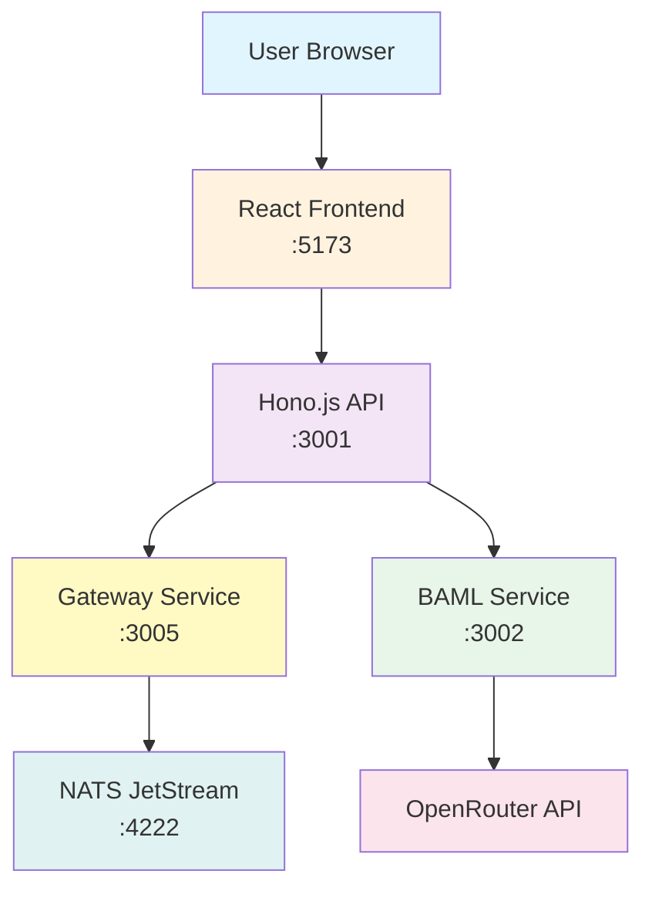

# API Architecture Breakdown - AngstromSCD Chat Flow

## Overview
This document explains the complete request/response flow for the AI chat functionality in AngstromSCD, detailing how a user's message travels through multiple services to generate an AI response using OpenRouter.

## System Architecture



## Complete Request Flow

### 1. User Initiates Chat (Frontend)
**Location**: `apps/frontend/src/components/chat/ChatInterface.tsx`

When a user types "explain sickle cell" and hits enter:

1. **ChatInterface Component** captures the message
2. **ChatContext** (`apps/frontend/src/context/ChatContext.tsx`) processes the request:
   ```typescript
   const sendMessage = async (content: string) => {
     // Message is sent via fetch to API
     const response = await fetch('http://localhost:3001/api/chat', {
       method: 'POST',
       headers: { 'Content-Type': 'application/json' },
       body: JSON.stringify({
         message: content,
         model: selectedModel, // e.g., "gemini-3-pro"
         conversationId: currentConversation.id
       })
     });
   }
   ```

3. **WebSocket Connection** is established with Gateway for real-time streaming:
   - Connects to `ws://localhost:3005`
   - Subscribes to conversation-specific events

### 2. API Receives Request
**Location**: `apps/api/src/index.ts`

The API server running on port 3001 handles the `/api/chat` POST request:

```typescript
app.post('/api/chat', async (c) => {
  const { message, model, conversationId } = await c.req.json();

  // Process through enhanced chat service
  const result = await chatService.processMessage(
    message,
    conversationId,
    model
  );

  return c.json(result);
});
```

### 3. Enhanced Chat Service Routes to BAML
**Location**: `apps/api/src/services/enhanced-chat-service.ts`

The service determines the model type and routing:

1. **Model Detection**:
   ```typescript
   const isOpenRouterModel = [
     "gemini-3-pro", "claude-sonnet-4.5", "minimax-m2",
     "glm-4.6", "gpt-5", "gpt-oss-120b"
   ].includes(model);
   ```

2. **BAML Service Call** (for cloud models):
   ```typescript
   if (isCloudModel) {
     const bamlResponse = await fetch("http://localhost:3002/chat", {
       method: "POST",
       headers: { "Content-Type": "application/json" },
       body: JSON.stringify({
         message,
         model,
         provider: "openrouter"
       })
     });
   }
   ```

### 4. BAML Service Processes Request
**Location**: `packages/baml/src/index.ts`

The BAML service (BoundaryML) handles the structured AI request:

1. **Receives HTTP Request** on `/chat` endpoint
2. **Creates Dynamic Client Registry**:
   ```typescript
   const clientRegistry = createClientRegistry("openrouter", "gemini-3-pro");
   ```

3. **Configures OpenRouter Client**:
   ```typescript
   cr.addLlmClient("DynamicClient", "openai", {
     model: "google/gemini-3-pro-preview",
     api_key: process.env.OPENROUTER_API_KEY,
     base_url: "https://openrouter.ai/api/v1",
     headers: {
       "HTTP-Referer": "http://localhost:5173",
       "X-Title": "AngstromSCD"
     }
   });
   ```

4. **Executes BAML Function** with timeout protection:
   ```typescript
   const result = await withTimeout(
     () => b.SimpleChat(query, { clientRegistry }),
     {
       timeoutMs: 45000, // 45 seconds for OpenRouter
       timeoutMessage: `SimpleChat timed out after 45000ms`
     }
   );
   ```

### 5. OpenRouter API Call
**Location**: External API - `https://openrouter.ai/api/v1`

BAML sends the request to OpenRouter:

1. **Request Format** (OpenAI-compatible):
   ```json
   {
     "model": "google/gemini-3-pro-preview",
     "messages": [
       {
         "role": "system",
         "content": "You are MedLab AI, a medical assistant specializing in Sickle Cell Disease (SCD)..."
       },
       {
         "role": "user",
         "content": "explain sickle cell"
       }
     ]
   }
   ```

2. **Authentication**: Via API key in headers
3. **Response Time**: ~14-20 seconds for Gemini 3 Pro

### 6. Response Flow Back

1. **OpenRouter → BAML**: Returns generated text
2. **BAML → API**: Wraps response in structured format:
   ```json
   {
     "success": true,
     "data": {
       "reply": "Sickle Cell Disease is an inherited blood disorder...",
       "model": "gemini-3-pro",
       "provider": "openrouter"
     }
   }
   ```

3. **API → Frontend**: Returns formatted response with metadata:
   ```json
   {
     "success": true,
     "data": {
       "reply": "...",
       "model": "gemini-3-pro",
       "visualizations": []
     },
     "meta": {
       "requestId": "uuid",
       "timestamp": "2025-11-19T14:22:43Z",
       "version": "1.0.0"
     }
   }
   ```

### 7. Real-time Streaming (Gateway + NATS)
**Location**: `apps/gateway/src/index.ts`

For real-time token streaming:

1. **Gateway WebSocket** accepts connections on port 3005
2. **NATS JetStream** manages event streams:
   - Stream: `CHAT_EVENTS`
   - Subjects: `chat.events.*`, `chat.tokens.*`
3. **SSE (Server-Sent Events)** delivers tokens to frontend
4. **Frontend Updates** UI progressively as tokens arrive

## Network Timing Breakdown

From your browser's network tab:

| Step | Duration | Details |
|------|----------|---------|
| DNS Lookup | 0ms | Localhost resolution |
| Initial Connection | ~1ms | TCP handshake |
| SSL/TLS | 0ms | HTTP (no HTTPS) |
| Request Sent | ~1ms | POST to API |
| **Waiting (TTFB)** | **18.465s** | Main processing time |
| Content Download | ~2ms | Response transfer |
| **Total** | **~18.5s** | End-to-end |

### Time Breakdown:
- Frontend → API: <1ms
- API → BAML: ~1ms
- BAML → OpenRouter: ~1ms
- **OpenRouter Processing**: ~14-16s (main bottleneck)
- OpenRouter → BAML: ~1ms
- BAML parsing: ~1s
- BAML → API: ~1ms
- API → Frontend: <1ms

## Key Configuration Files

### Environment Variables

**`packages/baml/.env`**:
```env
OPENROUTER_API_KEY=sk-or-v1-xxxxx
OPENROUTER_CHAT_TIMEOUT_MS=45000
BAML_CHAT_TIMEOUT_MS=45000
```

**`apps/api/.env`**:
```env
BAML_SERVICE_URL=http://localhost:3002
CORS_ORIGINS=http://localhost:5173
NATS_URL=nats://127.0.0.1:4222
GATEWAY_WS_URL=ws://localhost:3005
```

**`apps/frontend/.env`**:
```env
VITE_GATEWAY_WS_URL=ws://localhost:3005
VITE_API_URL=http://localhost:3001
```

### BAML Configuration

**`packages/baml/baml_src/clients.baml`**:
```baml
client<llm> OpenRouterGemini3Pro {
  provider "openai-generic"
  options {
    model "google/gemini-3-pro-preview"
    api_key env.OPENROUTER_API_KEY
    base_url "https://openrouter.ai/api/v1"
    headers {
      "HTTP-Referer" "http://localhost:5173"
      "X-Title" "AngstromSCD"
    }
  }
}
```

**`packages/baml/baml_src/simple_chat.baml`**:
```baml
function SimpleChat(query: string) -> string {
  client OpenRouterGemini3Pro
  prompt #"
    You are MedLab AI, a medical assistant specializing in Sickle Cell Disease (SCD).

    Respond to the following query in a helpful, conversational manner:
    {{ query }}

    Provide clear, evidence-based information when discussing medical topics.
    Always remind users to consult healthcare providers for personal medical decisions.
  "#
}
```

## Error Handling & Timeout Protection

### Timeout Configuration
- **Default timeout**: 20 seconds
- **OpenRouter timeout**: 45 seconds (due to slow response times)
- **Implementation**: Using `withTimeout()` wrapper in BAML service

### Error Flow
1. If OpenRouter times out → BAML returns 500
2. If BAML returns 500 → API catches and returns fallback message
3. Frontend displays: "I'm having trouble connecting to the OpenRouter service..."

## Performance Considerations

### Current Bottlenecks
1. **OpenRouter Response Time**: 14-20 seconds (main bottleneck)
2. **No caching**: Each request goes to OpenRouter
3. **Sequential processing**: No request batching

### Optimization Opportunities
1. Implement response caching for common queries
2. Add request queuing and batching
3. Consider faster models (GPT-4o-mini responds in 2-3s)
4. Implement progressive streaming for better UX
5. Add circuit breaker pattern for provider failures

## Running Services

To run the complete stack:

```bash
# Terminal 1: Infrastructure
cd infra
docker-compose up -d  # Starts NATS

# Terminal 2: Bootstrap NATS
bunx tsx infra/scripts/bootstrap-nats.ts

# Terminal 3: Gateway
cd apps/gateway
bun dev  # Port 3005

# Terminal 4: BAML Service
cd packages/baml
bun dev  # Port 3002

# Terminal 5: API
cd apps/api
bun dev  # Port 3001

# Terminal 6: Frontend
cd apps/frontend
bun dev  # Port 5173
```

## Troubleshooting

### Common Issues

1. **"Failed to connect to OpenRouter"**
   - Check OPENROUTER_API_KEY in packages/baml/.env
   - Verify timeout settings (needs >15s for Gemini)

2. **WebSocket connection failed**
   - Ensure Gateway is running on port 3005
   - Check NATS is running: `docker ps`
   - Bootstrap NATS streams if needed

3. **BAML service returns 500**
   - Usually timeout issue - increase OPENROUTER_CHAT_TIMEOUT_MS
   - Check BAML logs for specific errors

4. **Database connection errors**
   - Non-critical for chat functionality
   - Only affects persistence features

## Summary

The chat system successfully integrates multiple services to provide AI-powered medical assistance. The main flow is:

1. **User** → **Frontend** (React)
2. **Frontend** → **API** (Hono.js)
3. **API** → **BAML** (BoundaryML)
4. **BAML** → **OpenRouter** (AI Provider)
5. **OpenRouter** returns response (14-20s)
6. Response flows back through the same chain

The system includes real-time streaming capabilities via WebSocket/NATS but the primary bottleneck is OpenRouter's response time, which has been addressed by increasing timeouts to 45 seconds.